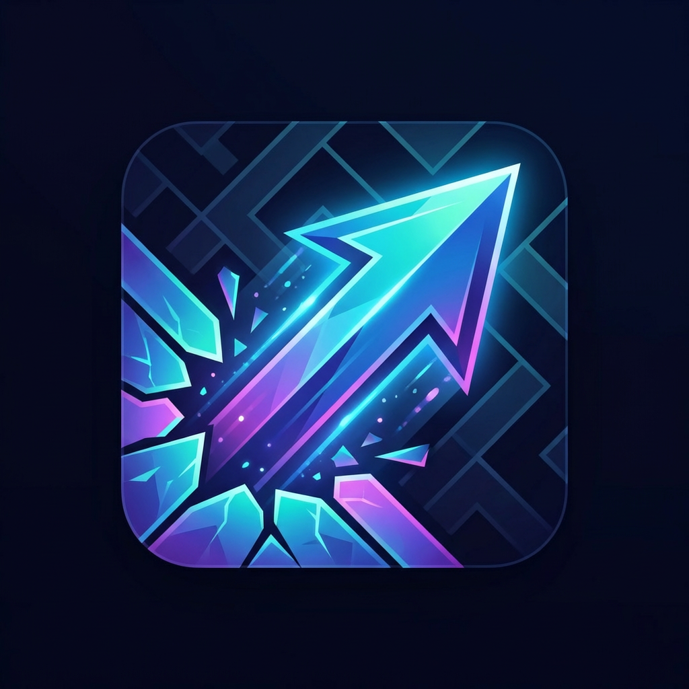

## Antigravity를 이용해 만들어졌습니다.

---

# 🎯 Arrow Escape

Arrow Escape는 **Flutter**와 **Flame Engine**을 기반으로 개발된 혁신적인 두뇌 개발 퍼즐 게임입니다.
빛나는 네온 화살표들을 움직여 복잡한 미로를 탈출해 보세요!

---

## 🎮 게임 플레이 요약 (Gameplay)

플레이어는 화면상의 "화살표 타일"을 이동시켜 목표 지점에 도달해야 합니다. 
하지만 일반적인 미로 게임과 달리, **타일이 미끄러지듯 이동(Sliding)** 하거나 **연쇄 반응**을 일으키는 등 독창적인 기믹이 숨어 있습니다.

*   수백 개의 독창적인 수제작(Hand-crafted) 레벨
*   진행할수록 추가되는 특수 기믹 (블록커, 텔레포트, 방향 전환 등)
*   **플랫폼**: Android, iOS (Cross-Platform) 지원

---

## 🌟 핵심 기능 (Key Features)

*   **🔒 완벽한 클라우드 동기화 (Google OAuth 연동)**
    *   Google 계정 로그인을 통해 기기를 변경해도 진행 상황, 점수, 남은 힌트 등이 실시간 저장(Firestore) 및 복원됩니다.
*   **🛡️ 안전한 계정 관리 (Soft-Delete & 복구)**
    *   앱 내에서 계정을 삭제하더라도, 데이터는 즉각 파기되지 않고 `deleted_users` 컬렉션으로 안전하게 격리 보관됩니다.
    *   **30일 이내에 재로그인하면 모든 계정 정보와 진행도를 100% 자동 복구**해주는 스마트 시스템이 탑재되어 있습니다.
*   **🌐 오프라인 캐싱 (Offline Support)**
    *   네트워크 연결이 끊겨도 게임 플레이 가능! 연결이 복구되면 백그라운드에서 서버와 알아서 동기화됩니다.
*   **📊 전용 관리자 웹 (Admin Dashboard 연동)**
    *   현재 유저들의 게임 플레이 클리어율, 막히는 구간 통계, 유저 랭킹 등을 한눈에 확인하는 별도의 React 구축 관리자 웹사이트가 연동되어 운영됩니다.
    *   👉 **관리자 코드 저장소**: [Arrow Escape Admin Repository](https://github.com/dnwls7738/arrow_escape_admin)

---

## 🛠️ 개발 기술 스택 (Tech Stack)

### Frontend (App)
*   **Framework**: Flutter (Dart)
*   **Game Engine**: Flame (`flame`, `flame_audio`)
*   **UI/UX**: Google Fonts, 최적화된 테마 컬러 (`#0D1520`)

### Backend & Service (Firebase)
*   **Authentication**: Google Sign-in OAuth 2.0
*   **Database**: Cloud Firestore (게임 데이터 실시간 동기화)
*   **Monetization**: Google Mobile Ads (보상형 광고, 전면 광고)

---

## 🚀 로컬 실행 방법 (Getting Started)

프로젝트를 다운로드하고 내 컴퓨터에서 빌드하는 전체 과정(Android Studio, 환경 변수, 에뮬레이터 세팅 등)은 별도의 가이드 문서에 상세히 적혀 있습니다.

👉 **자세한 로컬 세팅 & 실행 가이드 보기**: [DEV_SETUP.md](./DEV_SETUP.md)

### 필수 보안 파일 (🔥 중요)
본 프로젝트는 보안을 위해 Firebase 연동 비밀키가 GitHub에 뺘져(Ignore) 있습니다.
앱을 직접 빌드하려면 아래 키퍼즐을 가져와 각 위치에 넣어주세요.
* Android: `google-services.json` ➡️ `android/app/`
* iOS: `GoogleService-Info.plist` ➡️ `ios/Runner/`

---

## 👨‍💻 Developed By

**wjcheon**
*   Arrow Escape 프로젝트 기획, 클라이언트 앱 구현 및 Firebase 백엔드 아키텍처, Play Store 배포 총괄.
